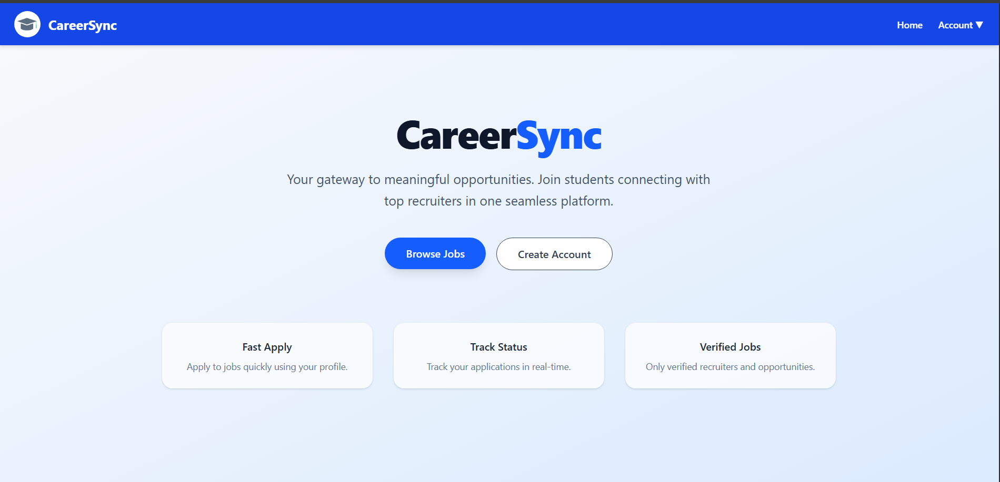
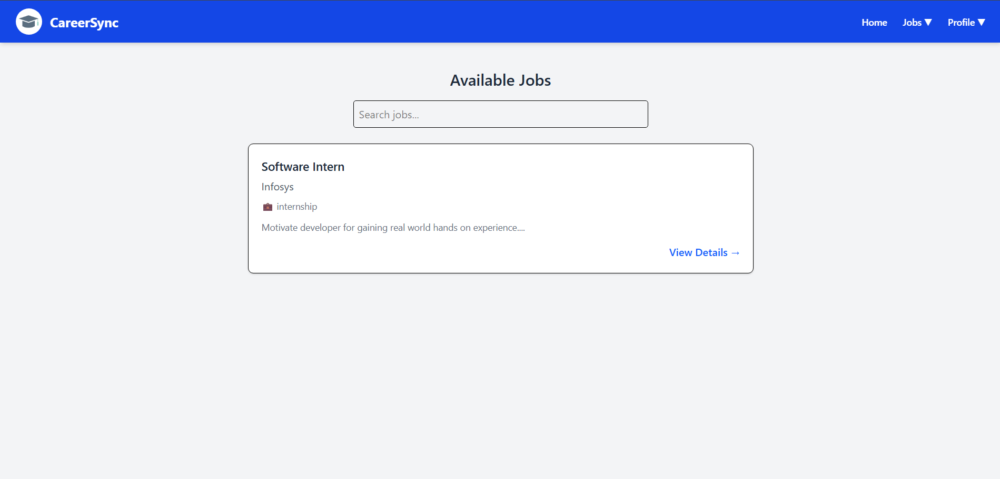
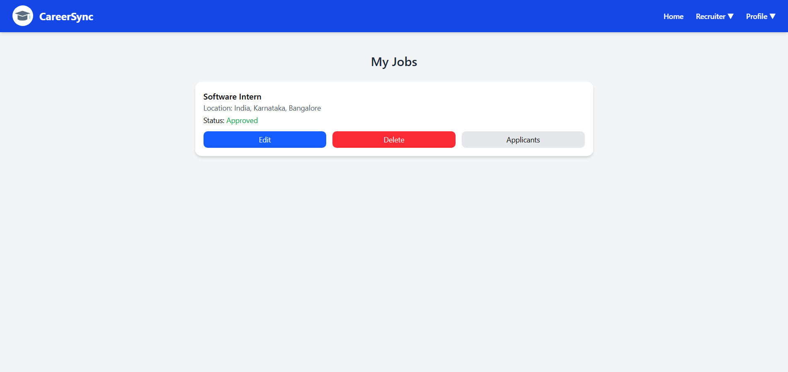

# CareerSync

🌐 Live Demo: https://career-sync-psi.vercel.app

💻 GitHub Repo: https://github.com/satyam-2x/CareerSync

## 🎯 Description
CareerSync is a placement portal that replaces messy WhatsApp-based recruitment with a structured dashboard, connecting students, recruiters, and TPOs in one place.

It was built to solve the problem of lost links and missed opportunities by centralizing all job updates.

---

## 🔑 Key Features

### 🛡️ Core Logic & Security
- **Admin Verification:** Both students and recruiters must be approved by the admin.  
- **Access Control:** Students cannot apply and recruiters cannot post jobs until verified.  
- **Secure Authentication:** Role-based protected routes for Student, Recruiter, and Admin.  

---

### 🎓 For Students
- **Profile Management:** Create and manage a profile with resume and skills.  
- **Smart Job Search:** Search and filter jobs easily.  
- **One-Click Apply:** Quick application process for verified users.  
- **Application Tracking:** Real-time status updates (Applied / Shortlisted / Rejected).  

---

### 💼 For Recruiters
- **Job Management:** Post, edit, and manage job openings.  
- **Applicant Management:** View all applications in a structured way.  
- **Shortlisting:** Update application status directly from dashboard.  

---

### 🛠️ For Admin (TPO)
- **Verification System:** Approve or reject users and recruiters.  
- **Dashboard Overview:** Monitor users, recruiters, and job drives.  

---

## 🛠️ Tech Stack

### Frontend
- React.js (UI Components)
- Tailwind CSS (Styling)

### Backend
- Node.js
- Express.js
- JWT (Authentication)

### Database & Storage
- MongoDB Atlas (NoSQL Database)
- Cloudinary (Media Storage)

### Deployment & Tools
- Vercel (Frontend Hosting)
- Render (Backend Hosting)
- Postman (API Testing)

---

## 🚀 CareerSync in Action

### 🏠 Home Page


### 🎓 Student Dashboard


### 💼 Recruiter Dashboard


---

## ⚙️ Installation

```bash
# Clone the repository
git clone https://github.com/satyam-2x/CareerSync.git
cd CareerSync

# Install server dependencies
npm install --prefix server

# Install frontend dependencies (client)
npm install --prefix frontend/client
```

---

## ▶️ Run Project

```bash
# Start server
npm run dev --prefix server

# Start frontend (React app)
npm run dev --prefix frontend/client
```

---

## 🔐 Environment Variables

### Backend (server/.env)
Create a `.env` file inside the server folder and add:

```env
PORT=5000
MONGO_URI=your_mongodb_uri
JWT_SECRET=your_jwt_secret

# Cloudinary
CLOUDINARY_CLOUD_NAME=your_cloud_name
CLOUDINARY_API_KEY=your_api_key
CLOUDINARY_API_SECRET=your_api_secret

# Admin Seed (optional)
ADMIN_EMAIL=your_admin_email
ADMIN_PASSWORD=your_admin_password

# Email Service (optional)
BREVO_API_KEY=your_brevo_api_key
```

---

### Frontend (frontend/client/.env)
Create a `.env` file inside the client folder and add:

```env
VITE_API_URL=your_server_url
```

---

### Note
For production, update `VITE_API_URL` with your deployed server URL.